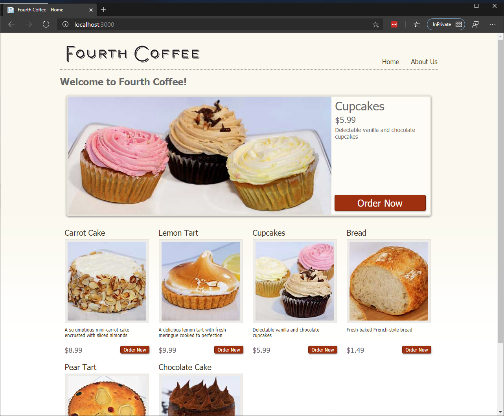

# FourthCoffee Application

## Sample ASP.NET application running with Windows Containers

## Variations

* **One Tier** - web frontend and database integrated into a single container

* **Two Tier** - web frontend and database split out into separate containers 